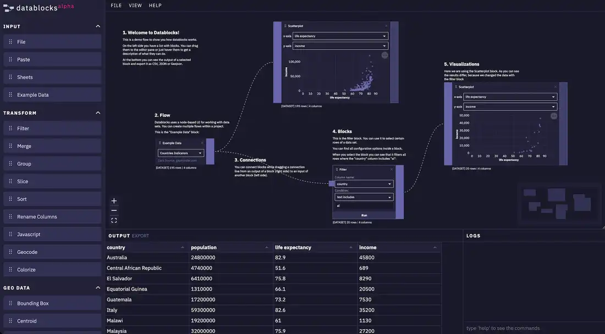
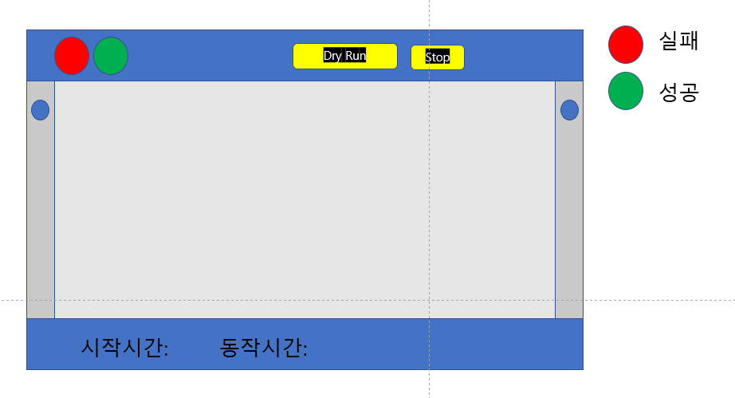

# DAGlyn
DAGlyn: Avalonia 기반의 고급 에디터로, 방향성 비순환 그래프(DAG)를 활용해 데이터 흐름을 디자인하고 시각화합니다. 
직관적인 노드 기반 GUI 상호작용에 최적화되어 효율적인 데이터 처리 워크플로우를 제공합니다.

## 현재 발생 문제점 및 개발 진행 사항
~~8/11/23 렌더링이 안되는 문제가 발생했다. WPF 에서는 Canvas 에서 잘 렌더링이 되었는데, Avalonia 에서의 Canvas 문제인지, 아니면 나의 코드가 문제인지 파악해야한다.~~  
~~8/12/23 렌더링이 안되는 문제는 Connection 의 문제점이라고 판단이 된다.~~      
~~8/12/23 초기화 문제 해결했다. 렌더링 되게 일단 완성했다. 아직 잠재적인 문제점이 있지만 일단 렌더링은 된다.~~ 
~~8/14/23 Node 바인딩 문제  
-- Connector 와 Connector 의 이름을 연결 시켜야 하는데, Compiled Binding 부분에서 잘 안됨. Binding 부분의 이해력 부족.  
-- ItemsControl 의 ItemSource 에 넣은 Item 의 내용을 ItemTemplate 에서 정의 한 ContentPresenter 에 이름으로 바인딩 시켜야 한다.~~  
~~8/19/23 ContentPresenter 바인딩이 안되는 문제가 발생했다.~~  
~~8/20/23 바인딩 문제는 해결했는데, Visual Tree 를 검사를 하면 DataTemplate 이하가 렌더링 되지 않는 문제가 발생한다.~~  
~~-- WPF 와 ContentPresenter 바인딩 하는 방식도 다르고, ContentPresenter 의 ContentTemplate 에 DataTemplate 을 적용하는 방식이 다른 것 같다.~~  

8/13/23 Node 를 일차적으로 테스트용으로 개발 진행중   
-- UI 형태만 만들고, Editor 로 넘어간 후, Editor 완성 후 디자인적으로 신경쓴다.   
~~8/15/23 Node 에 들어가는 Connector 를 구현 시작.~~      
~~-- Anchor 의 위치값을 부모로 부터 가져오는 것을 작성해야 한다.~~  
~~-- Node 를 저장할 수 있는 Container 를 만들어야 하고, 이 Container 는 위치값을 가져야 한다.~~    
~~-- Container 를 독립적으로 만들지 생각해봐야 한다.~~    
~~-- 일단 Canvas 에 넣어서 테스트 한번 진행하고, Connector 를 담을 수 있고, 위치 값을 가지는 Container 를 제작한다.~~    
~~8/16/23 Connector 에서 이벤트들을 구현한다. 이 이벤트를 통해서 부모에서 핸들러를 구현해서 사용할 수 있도록 한다.~~  
~~8/21/23 Connection, Connector, ItemContainer 연결 문제~~  
~~-- 서로 다른 좌표 영역에서 연결시켜야 하고, Connector 와 ItemContainer 는 **Connection 을 담을 수 있는 클래스가 아니다**.~~  
~~-- 어떻게 바인딩 시킬지 고민해야 한다. 좀 어렵다.~~  
8/22/23 **Connector, ItemContainer, Connection 클래스가 각각 독립적으로 설계하고 싶다.** 계속 종속적으로 구현하게 되는데 이것도 어렵다.  
8/22/23 Node 에 Connector 연결  

## 개발 고려 사항
1. 컨트롤들간에 데이터 송신 및 데이터 수신은 이벤트로 처리한다.  

## 향후 개발시 참고사항(그냥 기록용으로, 향후 삭제)
1. Toolbar 같은 경우는 AvaloniaEdit 을 한번 참고해본다.  

## 디자인 참고 및 스케치

